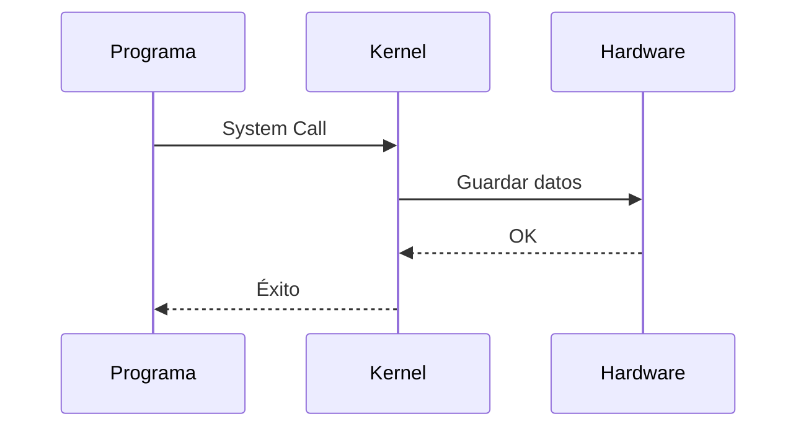

## ¿Qué es el Kernel?

Es la parte central de cualquier Sistema Operativo (**OS**), considerado como su núcleo.  
Es un programa de software escrito en lenguajes de bajo nivel, como **C** y lenguaje ensamblador.

### El proceso de arranque y la memoria RAM

El código del Kernel se guarda en el disco duro en forma de archivos.  
Cuando encendemos la máquina, ocurre el siguiente proceso:

1. Se ejecutan instrucciones básicas que van al disco duro y buscan los archivos con el código del Kernel.
2. Estos archivos se copian en la memoria RAM y la CPU empieza a ejecutarlos.
3. El Kernel se convierte en el primer programa en ejecutarse en nuestra máquina y permanece activo hasta que el equipo se apaga.

> El Kernel vive dentro de una porción exclusiva de la memoria RAM, a la cual se le llama **Kernel Space**.

### User Space y la interacción con el hardware

El Kernel se encarga de cargar todos los demás programas en otra parte de la RAM llamada **User Space**.  
Acá estos programas procesan su lógica y se ejecutan, pero tienen una restricción importante:

> ❌ No tienen contacto directo con el hardware.


Cuando los programas que se encuentran en el **User Space** necesitan interactuar con el hardware (hacer una acción física), siguen este proceso:

1. El programa emite una petición llamada **System Call** (*Llamada al Sistema*).
2. El programa entra en un estado de pausa temporal.
3. El Kernel, que se encuentra en el **Kernel Space**, recibe la petición y la ejecuta, ya que es el único que tiene contacto directo y seguro con el hardware.
4. Una vez se realiza la acción, el Kernel devuelve una señal de éxito al programa.
5. El programa sale de la pausa y retoma su ejecución normal.





### Ejemplo:

1. `El Arranque (El Kernel se instala)`
Enciendo mi computadora.  
El sistema operativo busca el código del Kernel en el disco duro, lo sube a la memoria RAM y lo encierra en su zona VIP y exclusiva: el **Kernel Space**.

✅ El Kernel ya está activo y monitoreando mi máquina.

2. `Ejecución normal (User Space)`
Abro **Visual Studio Code** para continuar con un proyecto en Java.  
El Kernel carga VS Code en la zona de los programas comunes, llamada **User Space**.

Mientras estoy escribiendo mi código, declarando variables y organizando la lógica, VS Code trabaja tranquilamente en esta área.

> En este punto, solo está procesando texto y colores en la pantalla; no necesita tocar componentes físicos críticos.


3. `La barrera física y el System Call`
Termino una clase y presiono `Ctrl + S` para guardar el archivo.

VS Code no tiene permiso para ir al disco duro físico a escribir esos datos.  
Por lo tanto, el programa se "pausa" por una fracción de segundo y emite un **System Call** (*Llamada al Sistema*).

```txt
"Oye, yo necesito guardar estos bytes en el disco físico, hazlo por mí"
```

4. `El Kernel interactúa con el hardware`
El Kernel, desde su **Kernel Space**, recibe la petición de VS Code.

Como el Kernel es el único con autorización y contacto directo con el hardware, se comunica con el disco duro (o SSD) y graba los datos de tu código físicamente en el almacenamiento.

5. `Éxito y retorno`
Una vez que los datos se guardaron correctamente en el disco, el Kernel le devuelve un mensaje de éxito a VS Code.

VS Code sale de su estado de pausa, retoma su ejecución normal, y es exactamente en ese milisegundo cuando veo que la pestaña de mi editor quita el punto de `"archivo sin guardar"` y me confirma que los cambios están seguros.


```mermaid
flowchart TB

    subgraph USER["🖥️ User Space"]
        A["VS Code / Programa"]
    end

    subgraph KERNEL["🧠 Kernel Space"]
        B["Kernel"]
    end

    subgraph HARDWARE["💾 Hardware"]
        C["Disco Duro / SSD"]
    end

    A -- "System Call" --> B
    B -- "Escribir datos" --> C
    C -- "Confirmación" --> B
    B -- "Éxito" --> A
````
