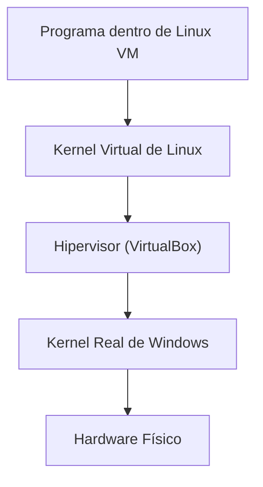

# ¿Qué es una VM o Virtual Machine?

# Antes: ¿Cómo funciona normalmente un computador?

Todo computador necesita dos partes principales para funcionar:

### 1. Hardware físico

Son los componentes reales y tangibles de la máquina, como por ejemplo.

- Procesador (**CPU**)
- Memoria **RAM**
- Disco duro o **SSD**
- Tarjeta madre
- Tarjeta de red

Este hardware es el que realmente mueve electricidad, ejecuta instrucciones y almacena datos físicamente.

### 2. Sistema Operativo (OS)

Es el software principal que controla todo el hardware y permite ejecutar programas, como por ejemplo:

- Windows
- Linux
- macOS

El Sistema Operativo se instala dentro del disco duro físico y trabaja directamente con el hardware mediante el **Kernel**.

> El Kernel es el único componente que puede comunicarse directamente con el hardware real. Ver [¿Qué es KERNEL?](/01-que-es-Kernel/README.md)

---

# ¿Qué es una Máquina Virtual (VM)?

Una **Máquina Virtual** es una computadora falsa creada por software dentro de otra computadora real.

En otras palabras:

> Una VM simula tener su propio hardware, aunque realmente está utilizando el hardware de la máquina original.

La VM recrea componentes virtuales como:

- Procesador virtual
- Memoria **RAM** virtual
- Disco duro virtual
- BIOS virtual
- Tarjeta de red virtual

>Aunque parecen componentes reales, todos son simulaciones creadas por software.

---

# Idea mental importante

Una VM es básicamente es "**Un computador dentro de otro computador**"

Por ejemplo:

```txt
Mi PC real
│
├── Windows
│
└── VirtualBox
    │
    └── Linux Ubuntu (VM)
```

Linux cree que tiene:

- Su propio procesador
- Su propia RAM
- Su propio disco duro

>Pero realmente está usando los recursos físicos del computador original.


# ¿Cómo funciona una VM?

Para que una VM funcione, necesita instalar un Sistema Operativo ``(OS)` dentro de ella. Exactamente igual que una computadora normal.

Por ejemplo:

```txt
Computador físico
└── Windows 11
    └── VirtualBox
        └── Ubuntu Linux
```

Ubuntu cree que está instalado en hardware real. Pero realmente:

- La RAM es prestada
- El procesador es compartido
- El disco duro es un archivo
- La red es virtualizada

> Todo es una simulación controlada por otro software.

# ¿Qué es el Hipervisor?

El **Hipervisor** es el programa encargado de crear y administrar máquinas virtuales. Se instala en la maquina física origianl

Ejemplos:

- VirtualBox
- VMware
- Hyper-V
- KVM

# Función del Hipervisor

El hipervisor es como un intermediario entre:

```txt
Máquina Virtual ↔ Hardware Real
```
La VM no puede tocar directamente el hardware físico de la maquina original.

Entonces el hipervisor:

- Intercepta las peticiones
- Traduce las operaciones
- Gestiona recursos
- Habla con el Kernel real

---

# ¿Qué hace realmente el Hipervisor?

Cuando creamos una VM, el hipervisor:

1. Reserva recursos físicos.
2. Simula hardware virtual.
3. Ejecuta el Sistema Operativo invitado.
4. Traduce operaciones virtuales en operaciones reales.

Por ejemplo:

```yaml
Esta VM tendrá:
# Hipervisor hizo la reserva de recursos fisicos comunicandole a KERNEL
- 4 GB RAM
- 2 núcleos CPU
- 50 GB de disco
```
Entonces el hipervisor le pide al Kernel real:

> "Reserva estos recursos mientras la VM esté encendida."

---

# Relación entre Hipervisor y Kernel
El hipervisor no mueve directamente el hardware. Quien realmente controla `la RAM`, `el disco`, `el procesador`, `los circuitos físicos`, es el **Kernel del Sistema Operativo anfitrión**.

Entonces el hipervisor hace:

## System Calls

hacia el Kernel real. Y el Kernel real es quien finalmente:

- mueve datos en RAM,
- escribe en el disco,
- administra CPU,
- controla dispositivos físicos.

---

# El disco duro virtual NO es real

La VM cree que tiene un disco duro físico propio, pero en realidad:

> El disco duro virtual es solamente un archivo gigante dentro del disco duro real.

Ejemplos:

```txt
Ubuntu.vdi
Windows10.vmdk
kali-linux.vdi
```

Ese archivo contiene:

- El Sistema Operativo virtual
- Los programas
- Los archivos
- Las configuraciones
- Todo el contenido de la VM

---

# Entonces... ¿qué ocurre realmente?

Imagina esto:

```txt
Mi Disco Duro REAL
│
├── Fotos
├── Juegos
├── Videos
└── Ubuntu.vdi
```

Ese archivo `.vdi` es literalmente el "disco duro falso" de la VM. Cuando Linux dentro de la VM guarda algo:

```txt
archivo.txt
```

realmente esos datos terminan escritos dentro del archivo: `Ubuntu.vdi`, que está almacenado en el disco físico verdadero.

---

# Relación completa entre VM, Hipervisor y Kernel



---

# ¿Qué ocurre cuando guardo un archivo dentro de una VM?

Ejemplo:

Estoy usando `Ubuntu` dentro de VirtualBox. Presiono **Ctrl + S** para guardar un archivo.

---

## Paso 1

El programa dentro de Ubuntu hace un `System Call` hacia el Kernel virtual de Linux.


## Paso 2

El Kernel virtual de **Linux** cree que tiene acceso a un disco duro real. Entonces intenta escribir datos.


## Paso 3

El Hipervisor intercepta esa operación porque realmente Linux *NO* tiene acceso al ``hardware físico``.


## Paso 4

VirtualBox le comunica la petición al **Kernel** real de Windows.

## Paso 5

El Kernel real mueve físicamente los circuitos:

- usa el SSD real,
- mueve datos reales,
- escribe bytes reales.

## Paso 6

Los datos terminan guardados dentro del archivo `Ubuntu.vdi`(El disco duro virtual de la **VM**):

---

# ¿Las Máquinas Virtuales son peligrosas?
Generalmente no porque existe bastante aislamiento entre la `Memoria RAM`, `Disco virtual`, `Procesos`, `Kernel virtual` y/o `Red virtual`. Por eso las VMs son muy usadas para:

- probar virus,
- practicar hacking ético,
- instalar Linux,
- ejecutar software peligroso,
- hacer pruebas,
- crear laboratorios,
- desarrollar servidores.


# ¿Qué significa "aislamiento"?

Significa que la VM normalmente está encerrada en un entorno separado. Por ejemplo:

```txt
VM infectada ≠ Windows real infectado
```

La VM tiene:

- su propia RAM virtual,
- su propio Kernel,
- sus propios procesos,
- su propio disco virtual.

> Por eso muchas veces, si algo malo ocurre dentro de la VM, simplemente se elimina el archivo `.vdi` y listo.

---

# Entonces... ¿cuál es el problema de las VMs?

El consumo de recursos porque realmente estamos ejecutando ``dos Sistemas Operativos al mismo tiempo``. Y ambos tienen:

- Kernel
- Procesos
- Interfaces gráficas
- Servicios de red
- Drivers
- Gestión de memoria
- Servicios en segundo plano

---

# ¿Por qué consumen tanta RAM y CPU?

Porque el computador físico debe:

1. Ejecutar Windows real.
2. Ejecutar VirtualBox.
3. Ejecutar Linux virtual.
4. Simular hardware constantemente.

Todo eso consume: **RAM**, **CPU**, **Disco**, **Energía**.

>Por eso las VMs pueden volverse pesadas e ineficientes.

---

# Entonces... ¿por qué las empresas usan VMs?

Porque permiten dividir servidores gigantes en muchos servidores pequeños. Empresas como: ``AWS (Amazon Web Services)``, ``Google Cloud``, ``Microsoft Azure``, tienen enormes centros de datos físicos. Y usan virtualización para fragmentar esos servidores.

---

# Ejemplo real

```txt
Servidor físico gigante
│
├── VM Empresa A
├── VM Empresa B
├── VM Empresa C
└── VM Empresa D
```

Cada empresa cree tener:

- su propio servidor,
- su propia RAM,
- su propio disco,
- su propio Linux.

> Pero realmente todos están compartiendo el mismo hardware físico gigante.

---

# Idea final importante
Las Máquinas Virtuales funcionan porque **Software puede simular hardware**

y porque el ``Hipervisor`` **+** ``Kernel``, trabajan juntos para engañar al Sistema Operativo virtual haciéndole creer que está dentro de una computadora real.